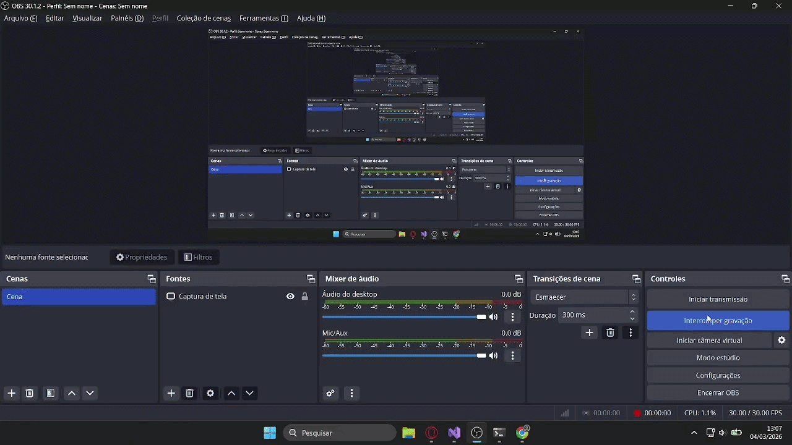

# 🚀 API CRUD Funcionários

API REST desenvolvida com **ASP.NET Core 8** e **SQL Server**, aplicando boas práticas como Service Layer, Injeção de Dependência e Entity Framework Core.

---

## 🛠 Tecnologias Utilizadas

- .NET 8
- ASP.NET Core Web API
- Entity Framework Core
- SQL Server
- Swagger (OpenAPI)

---

## 📌 Funcionalidades

- ✅ Criar funcionário
- ✅ Listar todos os funcionários
- ✅ Buscar funcionário por ID
- ✅ Atualizar funcionário
- ✅ Inativar funcionário
- ✅ Deletar funcionário

---

# ▶ Como testar a API

## ✅ Pré-requisitos

Antes de rodar o projeto, você precisa ter instalado:

- .NET 8 SDK
- SQL Server
- Visual Studio 2022 ou VS Code

---

##  1️⃣ Clonar o repositório
Ao iniciar novo projeto cole a URL para clonar o repositório

```
https://github.com/ThiagoJ-Dev/api-crud-funcionarios.git
```

## 2️⃣ Configurar a Connection String
Já com o projeto aberto vá até a pasta appsettings.json e altere "NOME_SERVIDOR_LOCAL" e "NOME_BANCO_DE_DADOS" para os respectivos a serem usados
```
{
  "Logging": {
    "LogLevel": {
      "Default": "Information",
      "Microsoft.AspNetCore": "Warning"
    }
  },
  "ConnectionStrings": {
    "DefaultConnection": "Data source=NOME_SERVIDOR_LOCAL ; database=NOME_BANCO_DE_DADOS ; Trusted_connection= true; Encrypt = false; TrustServerCertificate=true "
  },
  "AllowedHosts": "*"
}
```
## 3️⃣ Criar o banco de dados
Copie e cole no terminal do Visual Studio para criar seu banco de dados 
```
dotnet ef migrations add InitialCreate
dotnet ef database update
```
## 4️⃣ Executar a API
Rode o projeto e teste os endpoint via swagger

## 🎥 Demonstração

<p align="center">
  
</p>
